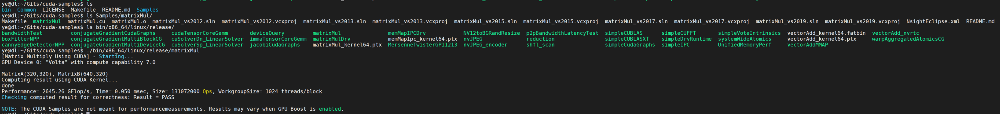
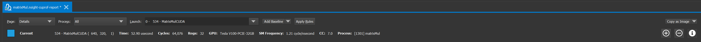
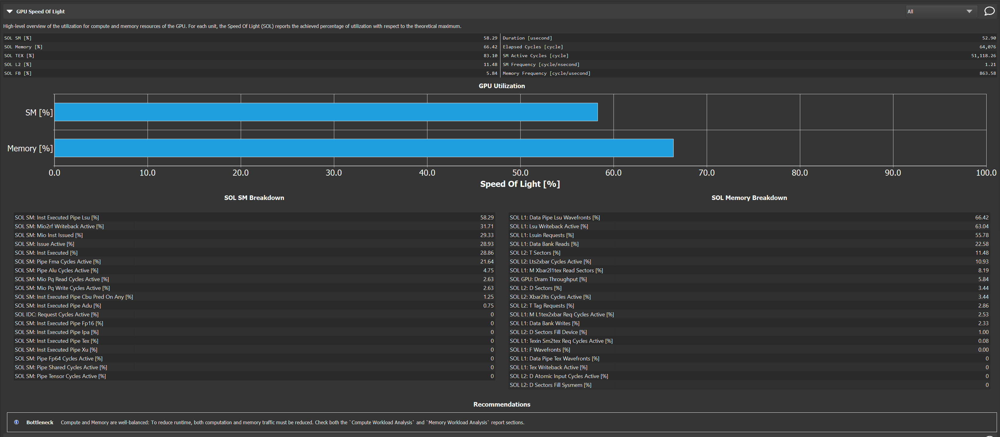
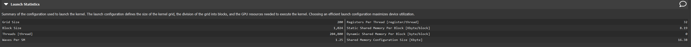
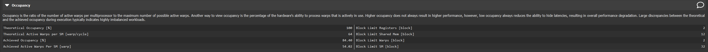
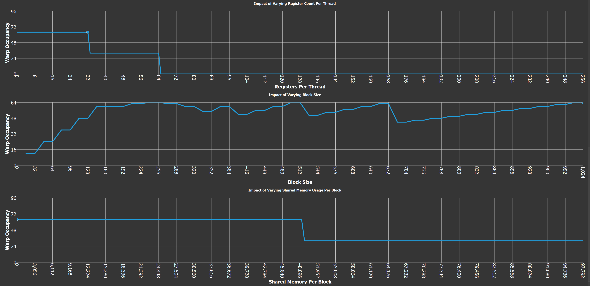
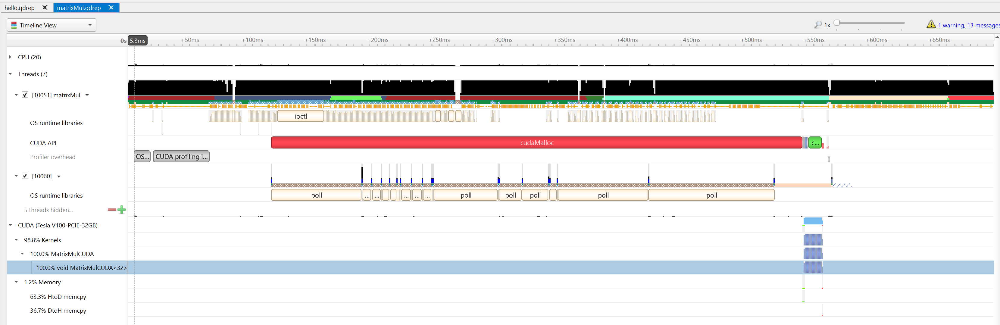
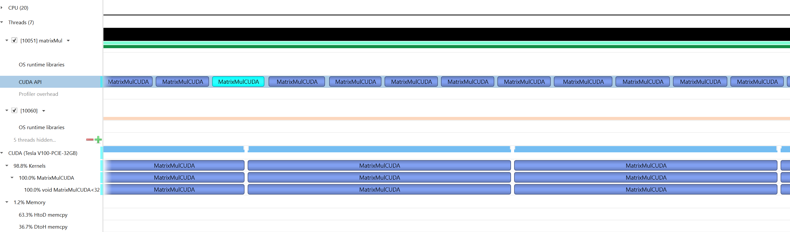

# MatrixMul CUDA example

Ye HE, 4/12/2020


https://github.com/NVIDIA/cuda-samples include many samples in code of CUDA.  Here I use [MatrixMul](https://github.com/NVIDIA/cuda-samples/tree/master/Samples/matrixMul) to show how to compile and run it. Then moving the major part, how to do profile by Nsight Systems/Compute and do basic analysis the profiling reports.


## Get the code 

```
$git clone https://github.com/NVIDIA/cuda-samples/
```


## Compile & Run

There is a top Makefile in the root DIR and each sample also has a respective Makefile.  Make and run it.




## Profiling 

NVIDIA provide Nsight Systems and Nsight Compute help you to profile you CUDA code. Nsight Systems do the systems level profiling Nsight Compute focus at CUDA kernel level. Please refer to NVIDIA official documents for more details.


### Nsight Compute

Get the report.

```
$nv-nsight-cu-cli -o matrixMul matrixMul
```

The "-o" defines the prefix of the report file name and ".nsight-cuprof-report" will be added as postfix by tools when profiling finished.

Then open the report file by Nsight Compute to check the details.

### Current info



### GPU Speed Of Light



The Recommendations will give you according to the real GPU SOL.

### Kernel Launch statistics



### Occupancy







## Nsight Systems

Get the report.

```
$nsys profile -t cuda,osrt -o matrixMul -w true --stats=true ./matrixMul
```

The "-o" defines the prefix of the report file name and a ".qdrep" and a ".sqlite"  report file are created with this prefix.

Then open the ".qdrep" by Nsight Systems to check the details.



Zoom in what you want to see in the timelines.


